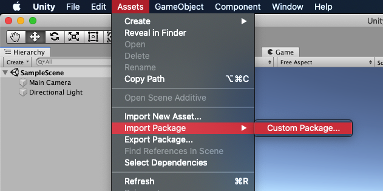
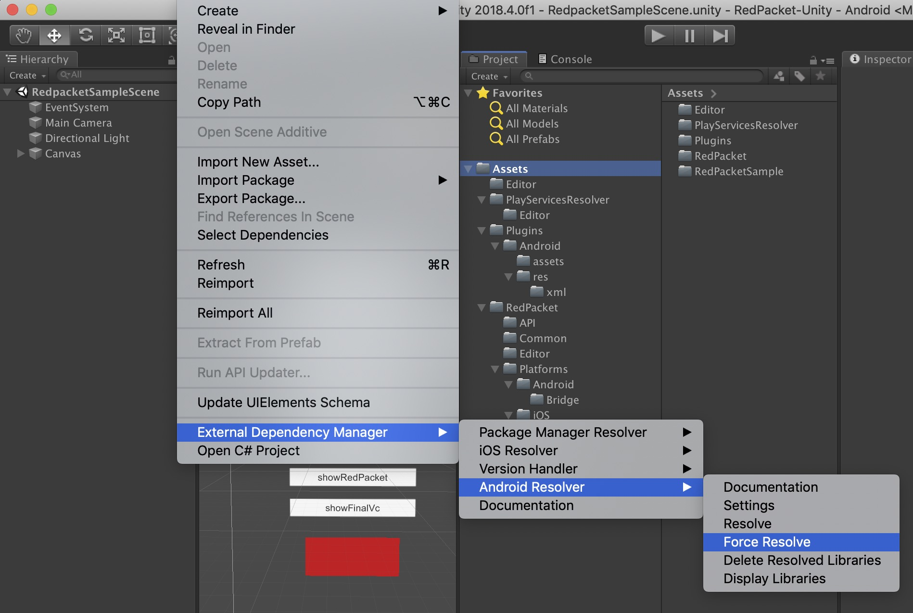
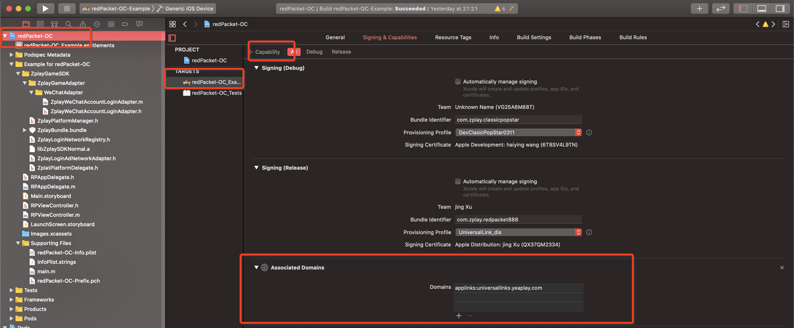
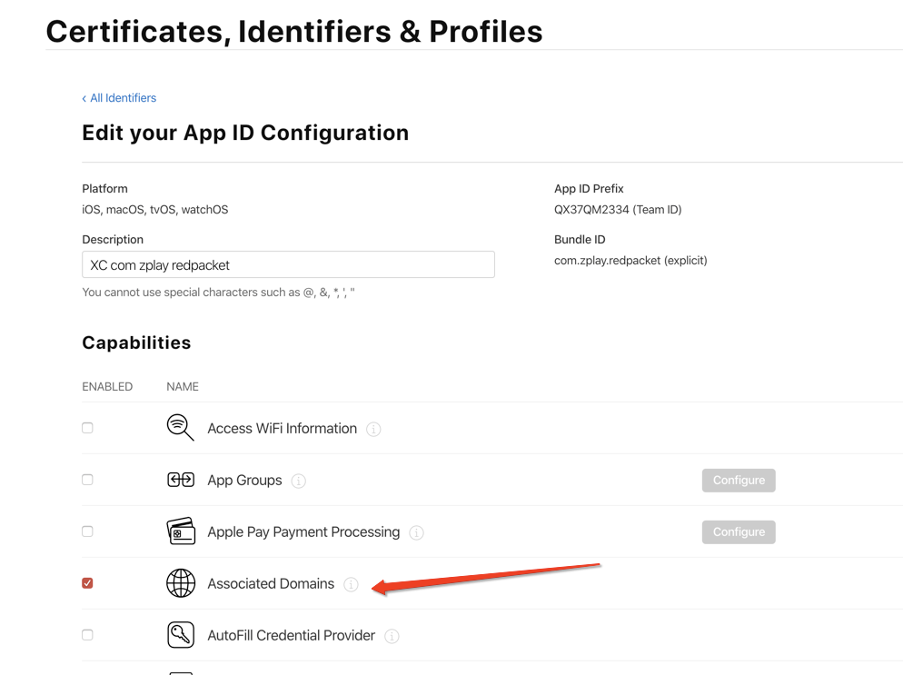
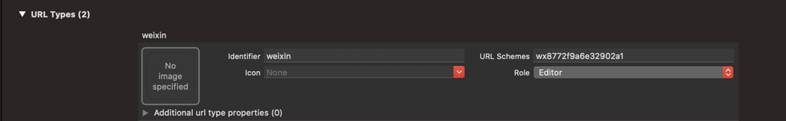
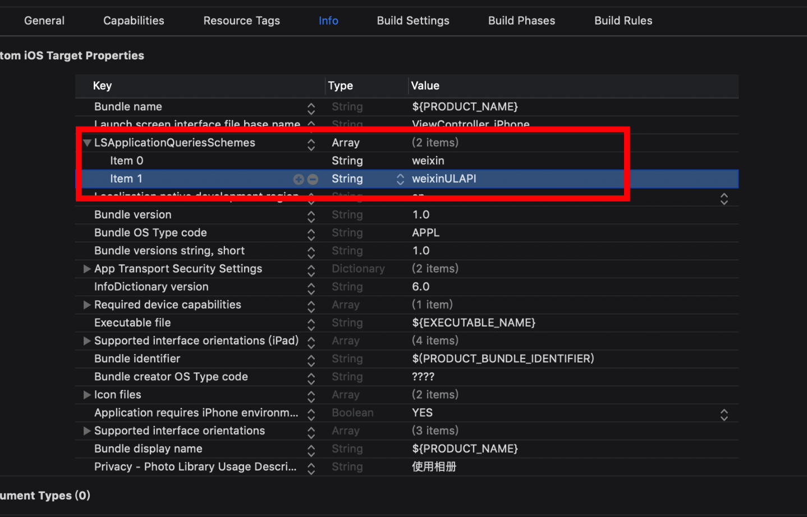
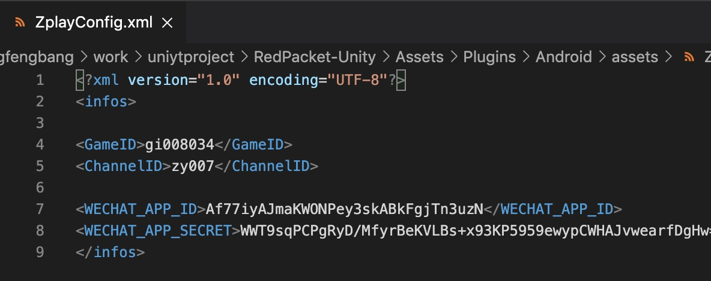
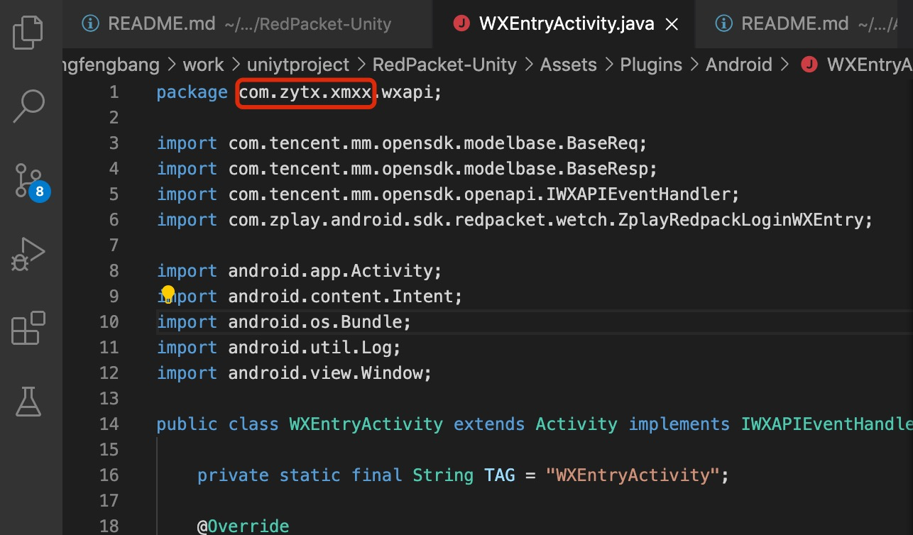
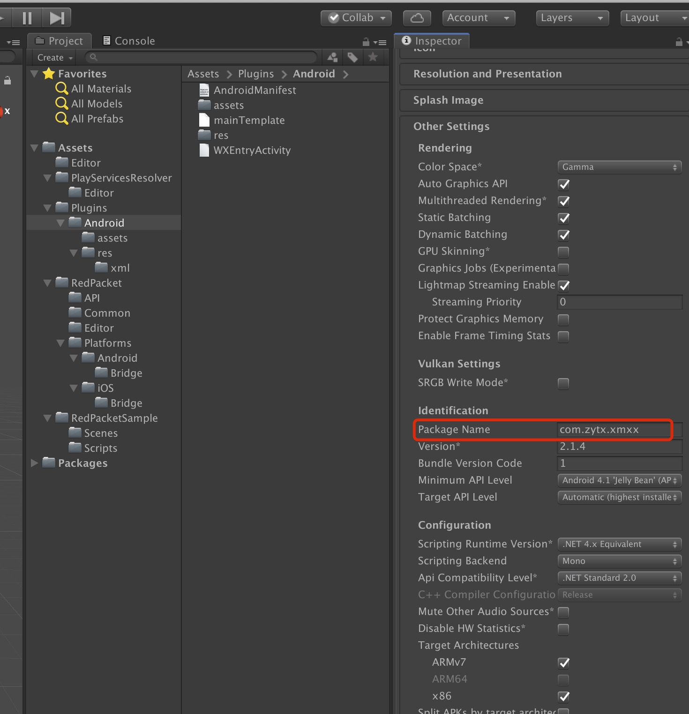

   * [红包 SDK Unity 接入文档](#红包-sdk-unity-接入文档)
      * [入门指南](#入门指南)
      * [下载红包 SDK Unity 插件](#下载红包-sdk-unity-插件)
         * [导入红包SDK Unity 插件](#导入红包sdk-unity-插件)
         * [加入红包 SDK](#加入红包-sdk)
            * [部署到 iOS](#部署到-ios)
            * [部署到 Android](#部署到-android)
         * [配置红包 SDK 参数](#配置红包-sdk-参数)
            * [配置iOS 参数](#配置ios-参数)
               * [Universal Link 配置](#universal-link-配置)
               * [Xcode 开发环境搭建](#xcode-开发环境搭建)
      * [红包 SDK API](#红包-sdk-api)

# 红包 SDK Unity 接入文档

## 入门指南

本指南适用于希望通过 Unity 应用获利的发布商。  

要接入 红包 SDK并赚取收入，第一步是将 红包 SDK Unity 插件集成到应用中（本页将介绍如何进行此项操作）。  

## 下载红包 SDK Unity 插件  

借助红包 SDK Unity 插件，Unity 开发者无需编写 Java 或 Objective-C 代码，即可轻松地在 Android 和 iOS 应用上接入红包SDK。  

请通过如下链接下载该插件的 Unity 软件包，或在 GitHub 上查看其代码。

[下载插件](https://github.com/yumimobi/RedPacket-Unity/releases/download/2.1.0/RedPacket.unitypackage)  
[查看源代码](https://github.com/yumimobi/RedPacket-Unity)  

### 导入红包SDK Unity 插件

在 Unity 编辑器中打开您的项目，然后依次选择 Assets > Import Package > Custom Package，并找到您下载的 RedPacket.unitypackage 文件。  



确保选择所有文件，然后点击 Import。

### 加入红包 SDK  

红包SDK Unity 插件随 Unity Play [服务解析器库](https://github.com/googlesamples/unity-jar-resolver)一起发布。 此库旨在供需要访问 Android 特定库（例如 AAR）或 iOS CocoaPods 的所有 Unity 插件使用。它为 Unity 插件提供了声明依赖项的功能，然后依赖项会被自动解析并复制到 Unity 项目中。

请按照下列步骤操作，确保您的项目包含红包SDK。 

#### 部署到 iOS   

您无需执行其他步骤即可将移动广告 SDK 加入 Unity 项目中。  
*注意：iOS 依赖项的标识是通过 CocoaPods 完成的，而 CocoaPods 是构建过程完成后的一个运行步骤。*  

#### 部署到 Android  

在 Unity 编辑器中，依次选择 Assets > External Dependency Manager > Android Resolver > Force Resolve。  
Unity Play 服务解析器库会将声明的依赖项复制到 Unity 应用的 Assets/Plugins/Android 目录中。  

*注意：红包SDK Unity 插件依赖项位于 Assets/RedPacket/Editor/RedPacketDependencies.xml 中*  

 

### 配置红包 SDK 参数

#### 配置iOS 参数
##### Universal Link 配置
1. 打开Associated Domains开关，将Universal Links域名加到配置上
   
   具体值为：
   
   ```
   applinks:universallinks.yeaplay.com
   ```
   
2. provisioning profile 需支持 Associated Domains
   
   

##### Xcode 开发环境搭建
1. 请先接入[最新 Unity 插件](https://github.com/yumimobi/RedPacket-Unity/releases/download/2.1.0/RedPacket.unitypackage)，后导出 Xcode 工程。
2. 在 Xcode 中，选择你的工程设置项，选中“TARGETS”一栏，在“info”标签栏的“URL type“添加“URL scheme”为你在微信后台所注册的应用程序 id（如下图所示）。
   

3. 在Xcode中，选择你的工程设置项，选中“TARGETS”一栏，在 “info”标签的“LSApplicationQueriesSchemes“添加weixin 和weixinULAPI（如下图所示）。
   
   
4. 在你需要使用微信终端 API 的文件中 import WXApi.h 头文件，并增加 WXApiDelegate 协议。
   ```
   #import <UIKit/UIKit.h>
   #import "WXApi.h"
   #import <RedPacket/RPWechatLogin.h>

   @interface AppDelegate : UIResponder<UIApplicationDelegate, WXApiDelegate>
   @property (strong, nonatomic) UIWindow *window;
   @end
   ```
5. 向微信注册
   ```
   - (BOOL)application:(UIApplication *)application didFinishLaunchingWithOptions:(NSDictionary *)launchOptions {

    //向微信注册
    [WXApi registerApp:APP_ID universalLink:UNIVERSAL_LINK];
    return YES;
   }
   ```

6. 重写AppDelegate 的 handleOpenURL 和 openURL 方法：
   ```
   - (BOOL)application:(UIApplication *)application handleOpenURL:(NSURL *)url {

    return [WXApi handleOpenURL:url delegate:[RPWechatLogin shared]];
   }

   - (BOOL)application:(UIApplication *)application openURL:(NSURL *)url sourceApplication:(NSString *)sourceApplication annotation:(id)annotation {
    return [WXApi handleOpenURL:url delegate:[RPWechatLogin shared]];
   }
   ```
   
7. 重写AppDelegate的continueUserActivity方法：
   ```
   - (BOOL)application:(UIApplication *)application continueUserActivity:(NSUserActivity *)userActivity restorationHandler:(void(^)(NSArray<id<UIUserActivityRestoring>> * __nullable restorableObjects))restorationHandler {
    return [WXApi handleOpenUniversalLink:userActivity delegate:[RPWechatLogin shared]];
}
   ```
8. ATS 设置
   ```
	<key>NSAppTransportSecurity</key>
	<dict>
		<key>NSAllowsArbitraryLoads</key>
		<true/>
	</dict>
   ```
9. 在info.plist中设置如下ID。具体值请联系产品获取
   ```
	<key>zchannelid</key>
    <string>ca429</string>
    <key>zgameid</key>
    <string>gi008034</string>
	<key>wesecertid</key>
	<string>0041402d49cce0bf18da652253e60611</string>
	<key>wechatid</key>
	<string>wx8772f9a6e32902a1</string>
   ```

#### 配置Android参数
1. 配置 Assets > Plugins > Android > assets > ZplayConfig.xml文件中的参数

 

<div style="background-color:rgb(228,244,253);padding:10px;">
<span style="color:rgb(62,113,167);">ZplayConfig.xml文件中的GameID, ChannelID, WECHAT_APP_ID，WECHAT_APP_SECRET参数，请联系掌游产品获取</span></div>
<br/>

2. 配置 Assets > Plugins > Android > WXEntryActivity.java 文件的包名

 

请将WXEntryActivity.java文件中的package改为 "应用包名" + ".wxapi"，否则会导致微信登录失败

 

3. 在 Assets > Plugins > Android > AndroidManifest.xml文件中增加如下配置
```xml
<activity
    android:name="应用 Packet Name.wxapi.WXEntryActivity"
    android:configChanges="keyboard|keyboardHidden|orientation|screenSize"
    android:exported="true"
    android:launchMode="singleTop"
    android:theme="@android:style/Theme.Black.NoTitleBar.Fullscreen" >
</activity>
```

<div style="background-color:rgb(228,244,253);padding:10px;">
<span style="color:rgb(62,113,167);">请将上面配置中的 "应用 Packet Name" 字段改为你应用的Packet Name，否则会导致微信登录失败</span></div>
<br/>

## 红包 SDK API

1. 初始化接口

```cs
    public void initRPSDK()
    {
        redPacketSDK = new RedPacket.API.RedPacketSDK(gameObject);
        redPacketSDK.OnSDKInitFailed += HandleInitFailed;
        redPacketSDK.OnSDKInitSuccess += HandleInitSuccess;
        redPacketSDK.OnLeftViewHasBeenShown += HandleLeftViewHasBeenShown;
        redPacketSDK.OnLeftViewHasBeenClicked += HandleLeftViewHasBeenClicked;
        redPacketSDK.OnRedPacketControllerHasBeenShown += HandleRedPacketControllerHasBeenShown;
        redPacketSDK.OnRedPacketControllerHasBeenDismissed += HandleRedPacketControllerHasBeenDismissed;
        redPacketSDK.OnRedPacketControllerHasBeenClicked += HandleRedPacketControllerHasBeenClicked;
        redPacketSDK.OnFinalRedPacketControllerHasBeenShown += HandleFinalRedPacketControllerHasBeenShown;
        redPacketSDK.OnFinalRedPacketControllerHasBeenDismissed += HandleFinalRedPacketControllerHasBeenDismissed;
    }
```

2. 判断 SDK 是否初始化成功
```cs
    public void isInitCompleted() 
    {
        redPacketSDK.IsInitCompleted();
    }
```

3. 展示用户中心入口
```cs
    /// <summary>
    /// 展示左上角用户中心入口，请在初始化成功后调用
    /// 最小宽度100pt，宽高比为2.35
    /// SDK将根据传入的宽度自动计算高度
    /// </summary>
    /// <param name="rect"></param>
    public void showLeftView()
    {   
        // leftView 为当前 canvas 挂载 UI，用户中心入口将以 left view 的 frame 布局
        // 请将 left view 设置为透明
        leftView.transform.position = new Vector3(x, y, 200);
        leftView.GetComponent<RectTransform>().sizeDelta = new Vector2(w, w);
        if (redPacketSDK != null)
        {
            redPacketSDK.ShowLeftView(leftView.transform);
        }
    }
```

4. 销毁用户中心入口
```cs
    /// <summary>
    /// 销毁左上角用户中心入口视图
    /// </summary>
    public void destroyLeftView()
    {
        if (redPacketSDK != null)
        {
            redPacketSDK.DestroyLeftView();
        }
    }
```
5. 判断红包是否准备好
```cs
    public void isReady()
    {
        if (redPacketSDK != null)
        {
            redPacketSDK.IsReady();
            statusText.text = "isReady: " + redPacketSDK.IsReady();
        }
    }
```
6. 展示红包领取界面
```cs
    /// <summary>
    /// 展示红包界面
    /// 展示条件：
    /// 1. 激励视频加载完成
    /// 2. 触发奖励条件
    /// </summary>
    public void showRedPacketController()
    {
        if (redPacketSDK != null)
        {
            redPacketSDK.ShowRedPacketController();
        }
    }
```
7. 展示红包结算界面
```cs
    /// <summary>
    /// 展示红包结算界面
    /// 展示条件：
    /// 1. 激励视频关闭且获得奖励
    /// </summary>
    public void showFinalRedPacketController()
    {
        if (redPacketSDK != null)
        {
            redPacketSDK.ShowFinalRedPacketController();
           
        }
    }
```

8. 实现回调
```cs
    #region RedPacket callback handlers
    /// <summary>
    /// 初始化失败
    /// </summary>
    public void HandleInitFailed(object sender, EventArgs args)
    {
        statusText.text = "HandleInitFailed";
        print("Redpacket---HandleInitFailed");
    }
    /// <summary>
    ///  初始化成功
    /// </summary>
    public void HandleInitSuccess(object sender, RPSDKEventArgs args)
    {
        statusText.text = "HandleInitSuccess: " + args.Message;
        print("Redpacket---HandleInitSuccess:" + args.Message);
    }
    /// <summary>
    /// 展示左上角用户中心入口
    /// </summary>
    public void HandleLeftViewHasBeenShown(object sender, EventArgs args)
    {
        statusText.text = "HandleLeftViewHasBeenShown";
        print("Redpacket---HandleLeftViewHasBeenShown");
    }
    /// <summary>
    /// 左上角用户中心入口被点击
    /// </summary>
    public void HandleLeftViewHasBeenClicked(object sender, EventArgs args)
    {
        statusText.text = "HandleLeftViewHasBeenClicked";
        print("Redpacket---HandleLeftViewHasBeenClicked");
    }
    /// <summary>
    /// 红包界面开始展示
    /// </summary>
    public void HandleRedPacketControllerHasBeenShown(object sender, EventArgs args)
    {
        statusText.text = "HandleRedPacketControllerHasBeenShown";
        print("Redpacket---HandleRedPacketControllerHasBeenShown");
    }
    /// <summary>
    /// 红包界面被关闭
    /// </summary>
    public void HandleRedPacketControllerHasBeenDismissed(object sender, EventArgs args)
    {
        statusText.text = "HandleRedPacketControllerHasBeenDismissed";
        print("Redpacket---HandleRedPacketControllerHasBeenDismissed");
    }
    /// <summary>
    /// 用户点击红包界面
    /// </summary>
    public void HandleRedPacketControllerHasBeenClicked(object sender, EventArgs args)
    {
        statusText.text = "HandleRedPacketControllerHasBeenClicked";
        print("Redpacket---HandleRedPacketControllerHasBeenClicked");
    }
    /// <summary>
    /// 红包结算界面展示
    /// </summary>
    public void HandleFinalRedPacketControllerHasBeenShown(object sender, EventArgs args)
    {
        statusText.text = "HandleFinalRedPacketControllerHasBeenShown";
        print("Redpacket---HandleFinalRedPacketControllerHasBeenShown");
    }
    /// <summary>
    /// 红包结算界面关闭
    /// </summary>
    public void HandleFinalRedPacketControllerHasBeenDismissed(object sender, EventArgs args)
    {
        statusText.text = "HandleFinalRedPacketControllerHasBeenDismissed";
        print("Redpacket---HandleFinalRedPacketControllerHasBeenDismissed");
    }

    #endregion
```